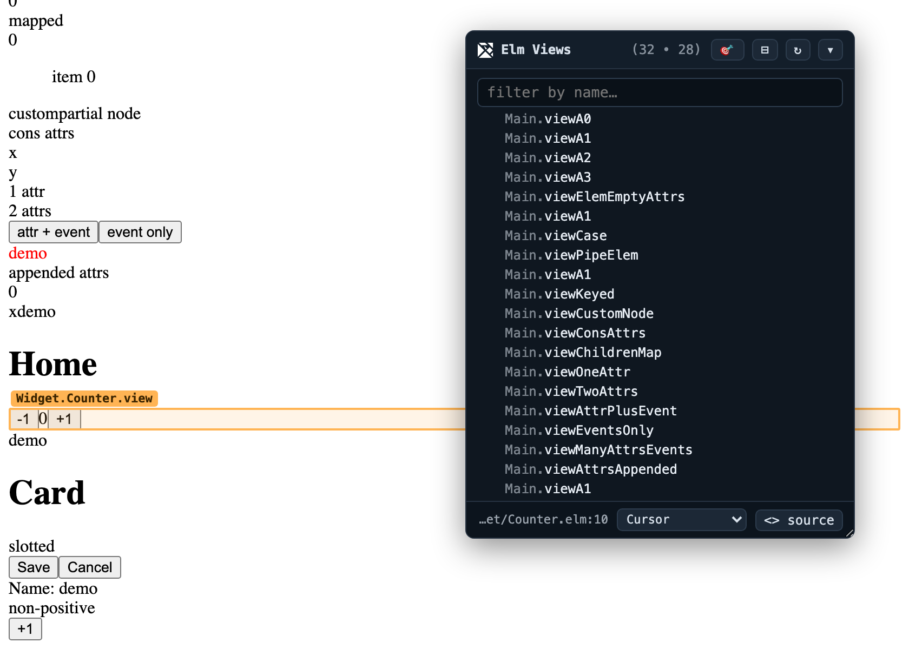

# elm-view-name-injector

DevTools-style **component names for Elm**. A post-compile transform that tags
each Elm view function's rendered element with an HTML attribute naming the
function that produced it:

```html
<div elm-view-name="Main.viewParent">
  <span elm-view-name="Main.viewChild">a</span>
  <span elm-view-name="Main.viewChild">b</span>
</div>
```

Point at any element in the browser and know which Elm function rendered it.
No source changes, **no wrapper nodes**, no runtime library — it edits the
compiled JS.



> Status: proof-of-concept. Works against Elm 0.19.1 output in standard **and
> `--debug`** modes. Intended as a **dev/QA build-time tool**, not for
> production bundles.

## ⚠️ Experimental — how to run it

Still early — a **dev/QA build-time tool**, never for production. Wire it into
your project's elm-watch postprocess once (see
[integrations/elm-watch-postprocess.md](integrations/elm-watch-postprocess.md))
and it's on in every dev/debug build — no flag:

```sh
npm start        # or however you launch elm-watch hot
```

Open the app (flip to **Debug** in the elm-watch overlay for the time-travel
debugger too) and the overlay badge appears top-right.

- **Production-safe.** Skipped in `optimize` mode, so `npm run build` is never
  affected.
- **Restart after wiring/changing the hook** — elm-watch loads it at startup.
- **Big apps cost a few seconds per recompile**, since it re-parses the bundle.
  Scope it to one target, or gate it behind an env var, if that bites.

Expect rough edges — if a page renders blank or the console fills with errors,
disable the hook and note what you were looking at.

### 🧪 In-page overlay (DevTools-style panel)

A tiny built-in panel that reads the `elm-view-name` attributes and gives you a
live **component tree**, **hover-to-highlight**, **click-to-select**, an
**inspect mode** (🎯 click any element on the page → find it in the tree), and
**search**. It's a pure viewer — no extra data injected, just a UI over the
attributes.

Enable it by appending the overlay runtime to the bundle:

```sh
# CLI
node bin/cli.js out.js -i --overlay

# example demo
node scripts/build-example.js --overlay && python3 -m http.server 8123 --directory example

# elm-watch project (with the postprocess hook): always on — just run it
npm start
```

The panel mounts in a shadow DOM on `<html>`, so it survives Elm re-renders
(even `Browser.application`, which owns `<body>`) and its styling can't leak into
the app.

#### Pop out into its own window

Click **⇱** in the panel header to detach the overlay into a separate browser
window — like the native Elm debugger's pop-out — so it stops covering the page
and you can park it on another monitor or desktop. Only the panel's DOM moves;
the highlight still draws on the real element in the app window. **⇤** pops it
back in.

In a multi-page app the inline overlay resets on every navigation. The popout
doesn't: it re-attaches to the same window on the next page load (a `localStorage`
flag + a named window), so it **follows you across pages**. See
[docs/popout.md](docs/popout.md) for how it works.

#### Jump-to-source

Select a view and the panel footer shows its `file:line`; click **`<> source`**
(or **double-click** a row) to open it in your editor. This needs a manifest
(`Module.decl → file:line`) built by scanning the Elm source, since compiled JS
has no source locations.

With the [elm-watch postprocess hook](integrations/elm-watch-postprocess.md)
this is **automatic** — the manifest is rebuilt and embedded on every compile
(scanning ~1.7k files is ~0.6s, and only the tagged views' entries are embedded).
For one-off / standalone use:

```sh
# embed the manifest directly: implies --overlay
node bin/cli.js out.js -i --manifest /path/to/elm-project

# OR emit it once and serve it; the overlay fetches /elm-view-manifest.json
# (with no-store) when nothing is embedded
node bin/manifest.js /path/to/project -o /path/to/project/public/elm-view-manifest.json
```

Pick your editor from the footer's **"Open in…"** dropdown — VS Code (+ Insiders),
Cursor, Windsurf, Zed, JetBrains, TextMate, Sublime — and it's remembered
(localStorage) across reloads. Advanced override: set `window.__elmViewEditor`
before the bundle loads to a `"…{file}…{line}…"` template or a
`(file, line) => url` function (takes precedence over the dropdown).

---

## Why not elm-review / a runtime helper?

Two hard constraints shaped this design:

1. **You cannot add an attribute to an existing `Html msg`.** It's opaque;
   attributes are set only at construction (`Html.node tag attrs kids`). There's
   no `addAttribute : Attribute msg -> Html msg -> Html msg`. A *runtime* helper
   would have to introduce a wrapper element.
2. **The compiled JS has no such limitation.** There, an element is just
   `A2($elm$html$Html$div, attrs, kids)` — the attribute list is a plain
   argument. So we splice our attribute directly onto the **real** element, and
   the fully-qualified name is *free* from the mangled variable name.

See [docs/DESIGN.md](docs/DESIGN.md) for the full comparison and codegen notes.

## How it works

When Elm compiles your code, every view function turns into very predictable
JavaScript — and that's what lets us do this without any Elm type information:

- A function like `Main.viewCard` becomes a variable named
  `$author$project$Main$viewCard`. We read the name straight back out of it.
- An element like `div [ ...attrs ] [ ...kids ]` becomes a function call whose
  first list argument is the element's attributes (that list also holds its
  event handlers).

So for each view function we find the element it returns and add one item to
that attribute list — the function's own name:

```js
// before
A2($elm$html$Html$div,  [ class "card" ],  kids)
// after
A2($elm$html$Html$div,  [ attribute "elm-view-name" "Main.viewCard", class "card" ],  kids)
```

Why it stays safe:

- The attribute is added with `_VirtualDom_attribute`, a built-in Elm helper
  that's always in the bundle — so the injected code can never point at
  something the compiler stripped out.
- **Nesting is free.** Each function only tags its own element. When one view
  calls another, that call already sits inside the parent's output, so the child
  tags itself — you get the whole nested tree automatically.
- **Anything that isn't a single element is skipped** (plain `text`, `Html.map`,
  lazy, or a function that just returns another view). Tagging nothing is better
  than tagging the wrong thing.

`--wrap` optionally tags the skipped `text`/`map`/`lazy` cases too, by wrapping
them in a layout-neutral `display:contents` div.

## Install

```sh
npm install    # @babel/parser, @babel/traverse, @babel/types
```

## Usage

```sh
# file -> file
node bin/cli.js out.js -o out.tagged.js --stats

# in place
node bin/cli.js out.js -i

# stdin -> stdout (for build pipelines)
cat out.js | node bin/cli.js --stdin > out.tagged.js
```

Options: `--attr <name>` (default `elm-view-name`), `--prefix <str>`
(default `$author$project$`), `--wrap`, `--stats`.

### With plain `elm make`

```sh
elm make src/Main.elm --output=app.js          # or --debug
node bin/cli.js app.js -i
```

### Quick try on an elm-watch project (one-shot)

Build a target un-optimized and tag its output in place (the output is
gitignored, so this doesn't touch your working diff):

```sh
npm run try:ui -- --ui /path/to/ui --target Client
# then serve WITHOUT hot (so it isn't overwritten) and inspect [elm-view-name]
```

For **live** tagging on every hot reload, see
[integrations/elm-watch-postprocess.md](integrations/elm-watch-postprocess.md)
(a small, env-gated, production-safe hook into the existing postprocess).

### With elm-watch (DEBUG / hot mode)

Add a postprocess step in `elm-watch.json` — it pipes the compiled JS on stdin:

```json
{ "targets": { "App": {
  "inputs": ["src/Main.elm"],
  "output": "build/app.js",
  "postprocess": ["node", "../elm-view-name-injector/bin/cli.js", "--stdin"]
}}}
```

Run the injector **before** any minifier in the chain — it reads the
`$author$project$` symbols, which terser/uglify would rename away. The injected
attribute *values* (`"Main.view"`) are string literals and survive minification.

## Try the example

The [`example/`](example/) corpus exercises ~30 view-function shapes (arity 0–3,
if/case/let/pipe/map/lazy/keyed/custom-node, 0–5 attrs+events, and negative
cases), spread across **7 modules** (`Main`, `Ui.*`, `Widget.*`, `Page.*`,
including the 3-segment `Page.Settings.Form`) to exercise demangling and
cross-module composition. See [example/README.md](example/README.md).

```sh
ELM_BINARY=/path/to/elm node scripts/build-example.js          # or: --debug / --wrap
python3 -m http.server 8123 --directory example                # open index.html
```

Then in the console: `document.querySelectorAll('[elm-view-name]')`.

## Test

```sh
npm test
```

Runs against a committed compiled fixture (`test/fixtures/corpus.compiled.js`) —
no Elm toolchain required. Asserts the full classifier table, branch handling,
negative cases, idempotency, output validity, and `--wrap`.

## Limitations

- **Un-minified input only** — run before terser/uglify.
- **Couples to Elm 0.19.x codegen internals** (stable across 0.19.0→0.19.1, but
  undocumented). Breaks loudly (no matches), not silently.
- Only elements can be splice-tagged; opaque returns need `--wrap` (which adds a
  node) or stay untagged. Delegation targets self-tag anyway.
- `display:contents` wrappers (from `--wrap`) can affect direct-child CSS
  selectors and `querySelector` expectations — hence dev-only.
- SVG is excluded by design.

## License

MIT
